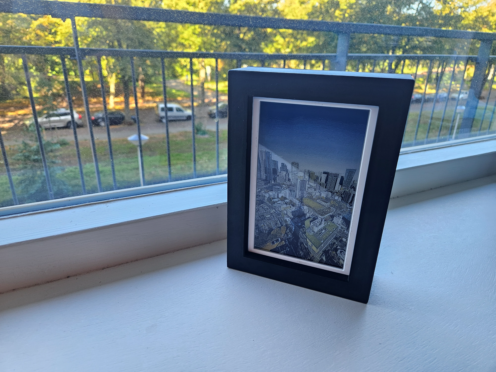
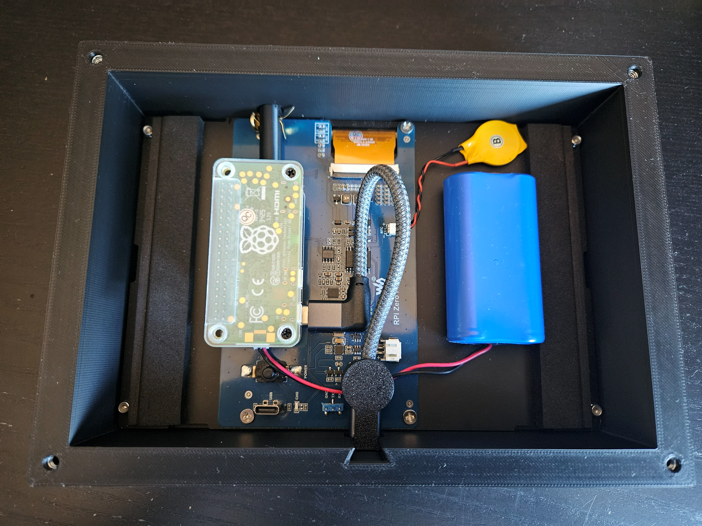

# Install Guide — Witty Pi PhotoPainter

An upgraded build based on the [Waveshare RPi Zero PhotoPainter](https://www.waveshare.com/rpi-zero-photopainter-acce.htm).
The original kit runs on the included Pi Zero W with a small built-in
battery, giving around ~6 hours of operation. This build adds a WittyPi
power manager and a larger Li-Ion battery. Refreshing the display once
an hour then gets you roughly **4 weeks** on a charge.

It also replaces the kit's wooden frame with a 3D-printed one, so the
larger battery fits and you can charge the frame without taking it apart.



---

## Shopping List

### Electronics

| Part | Notes |
|---|---|
| [Waveshare RPi Zero PhotoPainter](https://www.waveshare.com/rpi-zero-photopainter-acce.htm) | 7.3" e-ink display, 800×480, full colour (**E** variant) |
| Raspberry Pi Zero 2W | Can be bought with the kit |
| [WittyPi 4 mini](https://www.uugear.com/product/witty-pi-4-l3v7/) | Power management — schedules wake/sleep cycles. I got one with a 3.7V connector |
| Li-Ion battery | 3000–5000 mAh, connects to the WittyPi 4's battery header |
| 40-pin stacking header | Stacks the WittyPi 4 on top of the Pi and into the display |
| Brass M2.5 standoffs, 16 mm | For mounting |
| MicroSD card | 8 GB or more |

The stacking header and standoffs are what make it fit: the WittyPi 4
sits on top of the Pi Zero 2W, raised on standoffs to clear the
components underneath.

### 3D printed frame

STLs and print settings: **[Thingiverse](THINGIVERSE-URL)**

Four parts — frame, lid, push rod and cable clamp. Black PLA, 0.2 mm
layers, no supports. The frame print needs a pause near the end to drop
four M4 nuts into the corner pockets; full settings are on the
Thingiverse page.

| Part | Notes |
|---|---|
| 4 × M4 nuts (DIN 934) | Inserted during the frame print |
| 4 × M4×12 countersunk screws | Hold the lid on |
| USB-C extension cable, male to female | ~10 cm — [the one I used](https://www.amazon.nl/dp/B094XQXM8M) |
| Split pin | Retains the push rod |
| Foam padding | Lines the sides |

---

## Assembly



1. Stack the Pi Zero 2W, the standoffs and the WittyPi, and plug the
   extended pins into the display board
2. Remove the frame that ships in the kit to make room for the stack
3. Push the USB-C cable's female end into the pocket in the bottom edge
   of the printed frame, from the inside
4. Slide the clamp down over it — the dovetail locks it in place
5. Drop the push rod into the hole in the top edge and secure it with
   the split pin
6. Fit the foam, the display assembly and the battery
7. Screw the lid on with the four M4 screws

The USB-C port now sits in the bottom edge and the push rod reaches the
WittyPi's button, so charging and manual refreshes don't need the lid
off.

---

## Setup

### Step 1 — Prepare the Raspberry Pi

This build requires a **Raspberry Pi Zero 2W** running **Raspberry Pi OS
Lite (64-bit)**. The Waveshare kit ships with a pre-flashed Pi, but this
build uses none of their code, so you'll need a new SD card. Flash it
with the [Raspberry Pi Imager](https://www.raspberrypi.com/software/),
enable SSH and Wi-Fi in the imager settings, then boot and SSH in.

---

### Step 2 — Download and install

Download the artefact zip in the user directory of the Pi (where you SSH
into), unzip it and run the install script. Simple as!

```bash
wget https://github.com/michieljmmaas/witty-pi-photopainter/releases/latest/download/wittypi-photopainter.zip
unzip wittypi-photopainter.zip
sudo bash install.sh
sudo reboot
```

---

### Step 3 — Add photos

Copy photos (JPG, PNG, HEIC or BMP) to `~/photos_input/` on the Pi:

```bash
scp my-photo.jpg pi@{PI-NAME}:~/photos_input/
```

Then convert and dither them to the 7-colour e-ink palette:

```bash
python3 ~/convert_pictures.py
```

Converted images land in `~/my_photos/`. Duplicates (same filename) are
skipped automatically. You can also copy already-converted BMPs directly
to `~/my_photos/`:

```bash
scp your-photo.bmp pi@photoframe.local:~/my_photos/
```

The display script cycles through all images in `~/my_photos/` in random
order before repeating.

---

### Step 4 — Test and activate

SSH in (dev mode is enabled automatically, so the Pi stays on):

```bash
# Test the display manually
python3 ~/display_picture.py

# Check the log
tail -f ~/display_picture.log
```

When everything looks good, restore the normal schedule and shut down
cleanly:

```bash
~/goodnight.sh
```

The WittyPi wakes the Pi on the next hour boundary, runs the display
script, and shuts back down automatically.

---

## Schedule

The Pi wakes once per hour between 8:00 and 24:00, updates the display
with a new photo, and shuts down as soon as the refresh is done. This is
defined in `custom_2ms_every_waking_hour.wpi`.

Press the push rod in the top edge of the frame for a manual refresh.
The Pi stays on for 2 minutes after the press, which also gives you a
window to SSH in. Once connected, the automatic schedule is suspended
and the Pi stays on — work as needed, then run `~/goodnight.sh` when
you're done to resume the normal schedule and shut down cleanly.

---

## File overview

```
display_picture.py              Main script — reads battery, picks photo, drives display
convert_pictures.py             Convert & dither photos (drop in photos_input/, run this)
install.sh                      One-time setup (run once on a fresh Pi)
devmode.sh                      Switch to dev mode (Pi stays on)
normalmode.sh                   Switch to normal hourly schedule
goodnight.sh                    Restore normal schedule and shut down
clear_logs.sh                   Truncate all log/state files

custom_wittypi_code/
  afterStartup.sh               Hook: runs on every boot, triggers display_picture.py
  schedules/                    Power schedule files (.wpi)
```

---

## License

The code in this repository is released under the [MIT License](LICENSE)
— do whatever you like with it.

The install script downloads several third-party components that have
their own terms:

| Component | License |
|---|---|
| [WittyPi 4](https://github.com/uugear/Witty-Pi-4) | MIT |
| [WiringPi](https://github.com/WiringPi/WiringPi) | LGPL v3 |
| [Waveshare e-Paper](https://github.com/waveshare/e-Paper) | No explicit license |
| UUGear Web Interface | Closed-source, downloaded from uugear.com |

Full license texts and attribution notices are in [THIRD_PARTY_LICENSES](THIRD_PARTY_LICENSES).