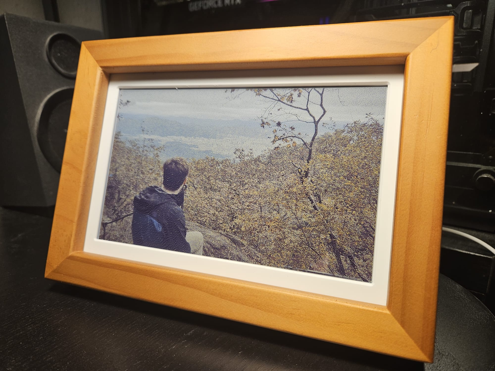
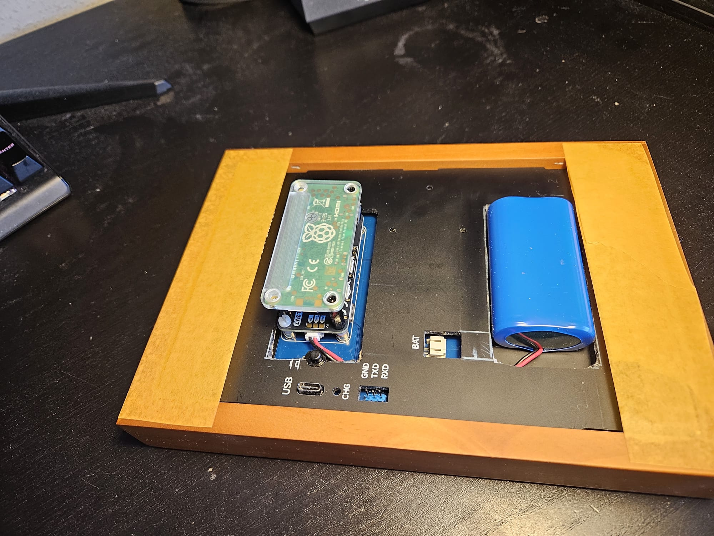
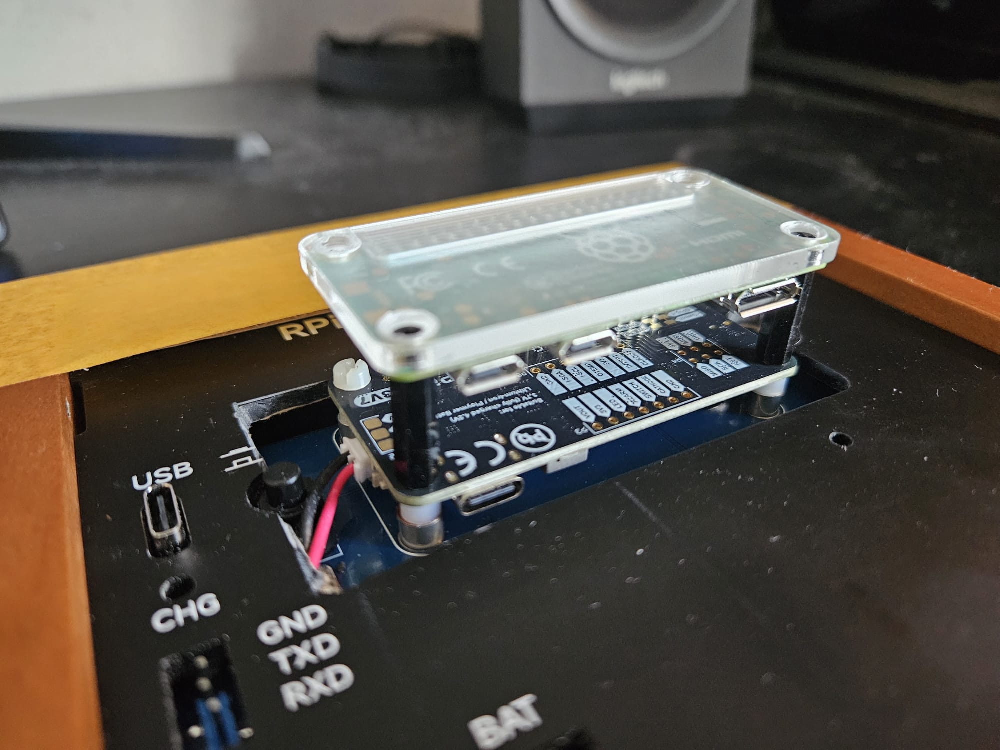

# Install Guide — Witty Pi PhotoPainter

This is an upgraded build based on the [Waveshare RPi Zero PhotoPainter](https://www.waveshare.com/rpi-zero-photopainter-acce.htm). The original kit runs on the included Pi Zero W with a small built-in battery, giving around ~6 hours of operation. This build adds a WittyPi power manager and a larger Li-Ion battery. Then, if you refresh the display once every hour you can extend the battery life to approximately **4 weeks**.



---

## Shopping List

| Part | Notes |
|------|-------|
| [Waveshare RPi Zero PhotoPainter](https://www.waveshare.com/rpi-zero-photopainter-acce.htm) | 7.3" ACeP e-ink display, 800×480, 7-color (**E** variant), includes case |
| Raspberry Pi Zero 2W | You can buy one with the kit.  |
| [WittyPi 4 mini](https://www.uugear.com/product/witty-pi-4-l3v7/) | Power management — schedules wake/sleep cycles - I got one with a 3.7V connector   |
| Li-Ion battery | 3000–5000 mAh, connects to WittyPi 4's battery header |
| 40-pin stacking header | Needed to stack the WittyPi 4 on top of the Pi, and into the display |
| Brass M2.5 standoffs 16 mm | For mounting |
| MicroSD card | 8 GB or more |

The stacking header and standoffs are what make it all fit together — the WittyPi 4 sits on top of the Pi Zero 2W, raised on the standoffs to clear the components underneath. The battery sits beside them in a cutout routed into the backplate.

## Assembly 


_I added some cardboard between the backplate and the rim of the frame, and then added some tape to hold everything in place._


_The Raspberry Pi goes on the bottom, then the extenders, and then the Witty Pi. Plug in the extended pins into the board. You will have to remove the existing frame that is place here to make room for it._ 

This current set-up isn't idea. You need to remove the whole backplate to reach the charging port. I am working on a STL file for a custom frame and backplate that you can 3d print that will make it all fit. Once I've got it, I will add it to to the repository. 

---

## Setup

### Step 1 — Prepare the Raspberry Pi

This build requires a **Raspberry Pi Zero 2W** running **Raspberry Pi OS Lite (64-bit)**. The Waveshare PhotoPainter kit ships with a pre-flashed Pi. This build uses none of their code, so you will need to provide a new SD card. Flash the card with the [Raspberry Pi Imager](https://www.raspberrypi.com/software/) (Raspberry Pi OS Lite 64-bit), enable SSH and Wi-Fi in the imager settings, then boot and SSH in.

---

### Step 2 — Download and install
Download the artefact zip in the user directory of the Pi (where you ssh into), unzip it and run the install script. Simple as!

```bash
wget https://github.com/michieljmmaas/witty-pi-photopainter/releases/latest/download/wittypi-photopainter.zip
unzip wittypi-photopainter.zip
sudo bash install.sh
sudo reboot
```

---

### Step 3 — Add photos

Copy photos (JPG, PNG, HEIC, or BMP) to `~/photos_input/` on the Pi:

```bash
scp my-photo.jpg pi@{PI-NAME}:~/photos_input/
```

Then convert and dither them to the 7-color e-ink palette:

```bash
python3 ~/convert_pictures.py
```

Converted images land in `~/my_photos/`. Duplicates (same filename) are skipped automatically. You can also copy already-converted BMPs directly to `~/my_photos/`:

```bash
scp your-photo.bmp pi@photoframe.local:~/my_photos/
```

The display script cycles through all images in `~/my_photos/` in random order before repeating.

---

### Step 4 — Test and activate

SSH in (dev mode is enabled automatically, so the Pi stays on):

```bash
# Test the display manually
python3 ~/display_picture.py

# Check the log
tail -f ~/display_picture.log
```

When everything looks good, restore the normal schedule and shut down cleanly:

```bash
~/goodnight.sh
```

The WittyPi will wake the Pi on the next hour boundary, run the display script, and shut back down automatically.

---

## Schedule

The Pi wakes up once per hour between 8:00 and 24:00, updates the display with a new photo, and shuts back down as soon as the refresh is done. This is defined in `custom_2ms_every_waking_hour.wpi`.

You can also trigger a manual refresh at any time by pressing the button on the WittyPi. The Pi will stay on for 2 minutes after the press, which also gives you a window to SSH in. Once connected, the automatic schedule is suspended and the Pi stays on — work as needed, then run `~/goodnight.sh` when you're done to resume the normal schedule and shut down cleanly.

---

## File overview

```
display_picture.py              Main script — reads battery, picks photo, drives display
convert_pictures.py             Convert & dither photos (drop in photos_input/, run this)
install.sh                      One-time setup (run once on a fresh Pi)
devmode.sh                      Switch to dev mode (Pi stays on)
normalmode.sh                   Switch to normal hourly schedule
goodnight.sh                    Restore normal schedule and shut down
clear_logs.sh                   Truncate all log/state files

custom_wittypi_code/
  afterStartup.sh               Hook: runs on every boot, triggers display_picture.py
  schedules/                    Power schedule files (.wpi)
```

---

## License

The code in this repository is released under the [MIT License](LICENSE) — do whatever you like with it.

The install script downloads several third-party components that have their own terms:

| Component | License |
|-----------|---------|
| [WittyPi 4](https://github.com/uugear/Witty-Pi-4) | MIT |
| [WiringPi](https://github.com/WiringPi/WiringPi) | LGPL v3 |
| [Waveshare e-Paper](https://github.com/waveshare/e-Paper) | No explicit license |
| UUGear Web Interface | Closed-source, downloaded from uugear.com |

Full license texts and attribution notices are in [THIRD_PARTY_LICENSES](THIRD_PARTY_LICENSES).

---

## To Do

- [ ] Custom STL file for the frame — a printed enclosure designed so all components (Pi, WittyPi, battery) fit nicely.
